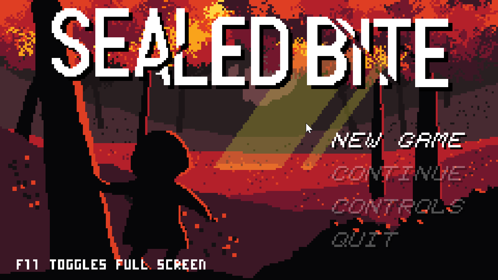

**[Sealed Bite](https://securas.itch.io/sealedbite-gamejamversion)** is a 2019 game jam game developed by **Securas**. This readme seeks to provide information about its speedrun.

# Mechanics

The player can jump and attack. Jumping has variable height based on how long the button is held. Attacks will only target the closest enemy in the direction the player is facing.
Attack range is increased by collecting coins.

Jumping has coyote time: the ability to jump a short time after walking off of solid ground.
Jumping can be buffered a short period before landing on the ground. You can buffer a jump during an attack and jump out of the ending player state.

The first crystal grants **wall climb**. You can jump up or away from walls, and clinging against one will eventually cause you to slide down.

The second crystal grants **double jump**.

The third crystal grants **block pushing**.

# Skips

All videos can be accessed in one location [here](https://imgur.com/a/Wq4d3en).

## Cutscene Skips

The player is able to move while the rooms are loading. In doing so, they may intersect or pass activation zones, such as room transitions or, in the lava crystal room, the first cutscene.

### Save and quit

Due to how gamestate is loaded and altered by cutscenes, a majority of cutscenes can be skipped by quitting to menu without closing the game, then continuing. Discovered by Dudude Dude.

Cutscenes included in this number are the opening attack and video by the wolf, and the awakening at the altar.

Not all cutscenes can be skipped in this manner, and some only partially without resulting in an unwinnable game state. The list of such cutscenes is as follows:

* the first dialogue with the wolf. A variant of this cutscene plays if the first has already been seen.
* the wolf's shadow granting block pushing. The powerup is not granted until the cutscene has fully resolved.
* the altar's final crystal. The prerequisite to unveil the wolf's lair is not granted until the crystals begin to form into the black crystal.
Prior to this discovery, this cutscene was skipped in a different, faster way.
* the cutscenes directly before and after the boss. Pausing is disabled, and the cutscene status is not stored in the gamestate regardless.

### Stacking

Due to how player state is changed by cutscenes, the unexpected overlapping of two cutscenes can cause player movement during the longer of the two.

A single cutscene is known to have a variable activation position: the coin in the altar room. This is because coins will drift to the player if approached but not collected.

By collecting the coin after activating the altar's final cutscene, the player can regain movement before the altar cutscene ends, and begin making their way to the wolf's lair. [video](https://i.imgur.com/dOZvSVU.mp4), though better setups have since been discovered.

Collecting the coin during the cutscenes of the other two crystals is known to have adverse effects, such as reducing the player's movement speed to 0.

## Movement Skips

A platform cycle in the forest can be skipped with a precise jump and attack at the start of the room. [video](https://i.imgur.com/iqAvQzl.mp4)

A tight spike-filled ascent in the mountain can be skipped by buffering a jump after an attack. [video](https://i.imgur.com/pueJie7.mp4)

The diagonal lava jets at the start of a room in the caves can be jumped over rather than walked under, perfectly timed from entering the room.

A lava pool beside a push block after the lava crystal can be skipped with a precise jump using coyote time. [video](https://i.imgur.com/uKs4eA1.mp4)

Cycles of the rotating lasers can be skipped by attacking the flying enemy, avoiding the push block with a double jump out of a wall jump ([video](https://i.imgur.com/yhxowBF.mp4)), and quick movement along the top of the room.

## Wrong Warp

An accidental discovery of an incorrect room transition to the second room of the game from the left of the caves room with the moving platforms resulted in a drastic route change.

The hypothesis was that returning to the altar via this transition would be faster than navigating the remainder of the caves properly.

It was found that the moving platforms were not perfectly aligned with the lava jets, and with precise movement, backtracking through the room was possible.

With a large enough attack range, the enemy at the start can be reached from the block formation between the left two moving obstacles. [video](https://i.imgur.com/PBTQBn8.mp4)

Before this was noticed, a slower, more dangerous route without requiring coins was discovered. [video](https://i.imgur.com/0X9Iq18.mp4)

# Route

## Pre/No Wrong Warp

Navigate to the altar as intended. Skip all cutscenes except the attack tutorial. Do not pick up the coin.

Navigate to the forest crystal. Timing has not been determined on if skipping the forest crystal cutscene is faster.

Do not return to the altar. Navigate to the mountain crystal. Do not skip the crystal's cutscene, but skip the ones before and after.

Return to the altar. Do not pick up the coin. Do not skip the two crystal cutscenes.

Navigate to the cave crystal. Skip the first cutscene by holding right. Do not skip the cutscenes of the crystal nor the wolf's shadow. Quit and continue to avoid the first cutscene a second time.

Return to the altar. Maneuver the coin to move during the crystal formation cutscene. Skip the lair opening cutscene. Complete the game.

## With Wrong Warp

As above, until reaching the cave crystal. Skip the crystal cutscene and leave, as block pushing is unnecessary.

Navigate the platform room in reverse. Return to the altar from the second room of the game, quitting and continuing at the appropriate time. Complete the game.

## Not yet routed

All Coins has minimal difference to the No Wrong Warp route. Coin locations have not yet been recorded.

No Coins has minimal difference to the With Wrong Warp route, though with fewer skips and more difficult execution.

Pacifism (of regular enemies) is hypothetically possible and may be combined with No Coins.
